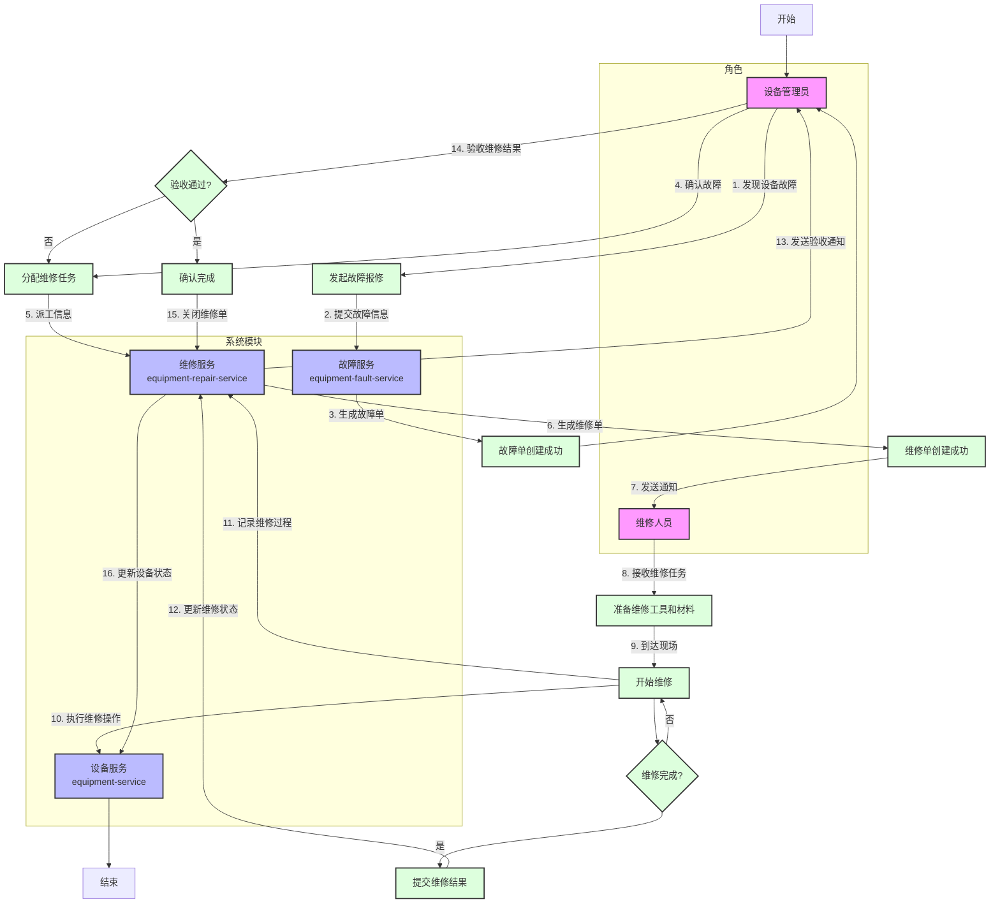

# 设备管理系统业务流程图

## 设备维修业务流程

## 业务流程说明

### 1. 故障报修
- **角色**：设备管理员
- **操作**：设备管理员发现设备故障，登录系统发起故障报修
- **系统模块**：故障服务（equipment-fault-service）
- **数据操作**：生成故障单，记录故障设备、故障描述、故障时间等信息

### 2. 故障确认与派工
- **角色**：设备管理员
- **操作**：设备管理员确认故障信息，根据故障类型和紧急程度分配维修任务
- **系统模块**：维修服务（equipment-repair-service）
- **数据操作**：生成维修单，记录派工时间、紧急程度、维修人员等信息

### 3. 维修任务通知
- **系统模块**：维修服务（equipment-repair-service）
- **操作**：系统自动向维修人员发送维修任务通知
- **通知方式**：系统消息通知

### 4. 维修执行
- **角色**：维修人员
- **操作**：维修人员接收维修任务，准备维修工具和材料，到达现场开始维修
- **系统模块**：设备服务（equipment-service）、维修服务（equipment-repair-service）
- **数据操作**：记录维修开始时间、维修过程、使用的材料等信息

### 5. 维修结果提交
- **角色**：维修人员
- **操作**：维修完成后，维修人员提交维修结果，包括维修情况说明、故障原因、处理方式等
- **系统模块**：维修服务（equipment-repair-service）
- **数据操作**：更新维修单状态为"待验收"

### 6. 维修结果验收
- **角色**：设备管理员
- **操作**：设备管理员验收维修结果，确认设备是否正常运行
- **系统模块**：维修服务（equipment-repair-service）
- **决策点**：
  - 验收通过：确认维修完成，关闭维修单
  - 验收不通过：重新分配维修任务，返回步骤2

### 7. 维修完成
- **系统模块**：维修服务（equipment-repair-service）、设备服务（equipment-service）
- **操作**：
  - 关闭维修单，更新维修单状态为"已完成"
  - 更新设备状态为"正常"
  - 记录维修结束时间

## 业务流程特点

1. **完整的闭环流程**：从故障报修到维修完成，形成完整的业务闭环
2. **多角色协同**：涉及设备管理员和维修人员两个主要角色，需要密切协作
3. **系统模块联动**：故障服务、维修服务和设备服务三个系统模块协同工作
4. **决策点明确**：包含维修完成确认和验收通过两个关键决策点
5. **数据完整记录**：每个流程步骤都有相应的数据记录，确保维修过程可追溯

## 业务流程优化建议

1. **自动化派工**：根据维修人员技能、地理位置等因素，实现智能自动派工
2. **实时状态更新**：提供维修进度实时更新功能，方便设备管理员查看
3. **维修知识库**：建立维修知识库，方便维修人员查询类似故障的解决方案
4. **满意度评价**：增加维修满意度评价功能，持续改进维修服务质量
5. **数据分析**：对维修数据进行分析，识别高频故障设备和故障类型，提前进行维护

## 相关业务流程

### 1. 设备巡检业务流程
- 设备管理员制定巡检计划
- 巡检人员执行巡检任务
- 记录巡检结果
- 发现问题及时处理

### 2. 设备维护业务流程
- 设备管理员制定维护计划
- 维护人员执行维护任务
- 记录维护结果
- 更新设备维护记录

### 3. 设备故障管理流程
- 故障代码管理
- 故障记录查询
- 故障统计分析

以上业务流程构成了设备管理系统的核心功能，通过这些流程实现了设备的全生命周期管理。