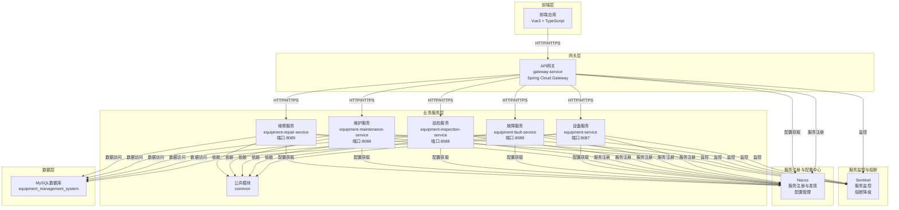

# 设备管理系统微服务架构图

## 架构说明

### 1. 前端层
- 采用Vue3 + TypeScript开发，实现设备管理系统的用户界面
- 通过HTTP/HTTPS协议调用后端API网关提供的接口

### 2. 网关层
- 使用Spring Cloud Gateway作为API网关，负责请求路由、负载均衡和安全控制
- 配置了多个路由规则，将不同路径的请求转发到对应的微服务
- 支持服务发现，自动获取注册到Nacos的服务实例

### 3. 服务注册与配置中心
- 使用Nacos作为服务注册与发现中心，实现微服务的动态注册和发现
- 同时作为配置中心，管理所有微服务的配置信息
- 支持动态配置更新，无需重启服务即可更新配置

### 4. 服务监控与熔断
- 使用Sentinel实现服务监控和熔断降级
- 实时监控服务的QPS、响应时间、错误率等指标
- 当服务出现异常时，自动触发熔断或降级，保护系统稳定性

### 5. 业务服务层
- **设备服务(equipment-service)**：管理设备基本信息、负责人信息等
- **故障服务(equipment-fault-service)**：管理设备故障代码、故障记录等
- **巡检服务(equipment-inspection-service)**：管理设备巡检计划、巡检记录等
- **维护服务(equipment-maintenance-service)**：管理设备维护计划、维护记录等
- **维修服务(equipment-repair-service)**：管理设备维修申请、维修记录等
- **公共模块(common)**：提供各微服务共享的实体类、异常处理、结果封装等功能

### 6. 数据层
- 使用MySQL数据库存储所有业务数据
- 数据库名称：equipment_management_system
- 各微服务通过MyBatis框架访问数据库

## 通信方式

1. **前端与后端通信**：通过HTTP/HTTPS协议，前端调用API网关提供的接口
2. **API网关与微服务通信**：通过HTTP/HTTPS协议，基于服务名进行负载均衡调用
3. **微服务间通信**：通过Nacos服务发现，基于服务名进行HTTP调用
4. **服务与配置中心通信**：通过HTTP协议，实现服务注册和配置获取
5. **服务与监控中心通信**：通过HTTP协议，上报服务状态和监控数据
6. **服务与数据库通信**：通过JDBC协议，使用MyBatis框架进行数据访问

## 服务端口配置

| 服务名称 | 端口号 | 描述 |
|---------|------|------|
| gateway-service | 8086 | API网关服务 |
| equipment-service | 8087 | 设备服务 |
| equipment-fault-service | 8088 | 故障服务 |
| equipment-inspection-service | 8088 | 巡检服务 |
| equipment-maintenance-service | 8088 | 维护服务 |
| equipment-repair-service | 8089 | 维修服务 |
| Nacos | 8848 | 服务注册与配置中心 |
| Sentinel Dashboard | 8081/8088 | 服务监控和熔断中心 |
| MySQL | 3306 | 数据库服务 |

## 技术栈

| 类别 | 技术 | 版本 |
|-----|------|------|
| 后端框架 | Spring Boot | 2.3.12.RELEASE |
| 微服务框架 | Spring Cloud | Hoxton.SR12 |
| 服务注册与发现 | Nacos | 2.0.4 |
| 服务监控与熔断 | Sentinel | 1.8.3 |
| API网关 | Spring Cloud Gateway | 2.2.9.RELEASE |
| ORM框架 | MyBatis | 2.1.4 |
| 数据库 | MySQL | 8.0+ |
| 前端框架 | Vue | 3.x |
| 前端语言 | TypeScript | 4.x |
| 构建工具 | Maven | 3.x |
| 前端构建工具 | Vite | 2.x |
